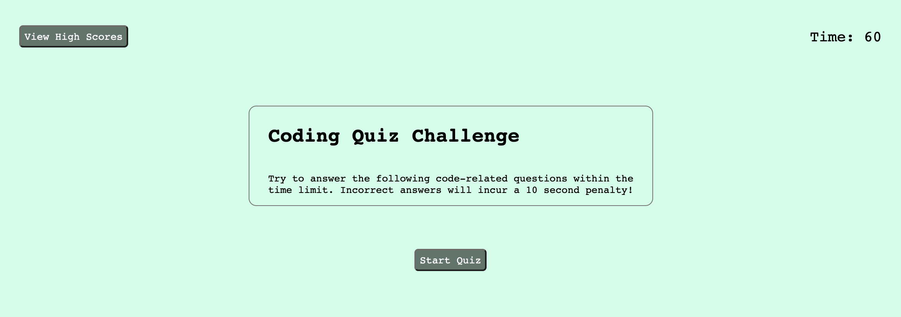

# Code Quiz

This assignment focuses on using DOM manipulation to create a timed quiz with multiple-choice questions. Throughout the quiz, there should be a timer counting down. There was a need to create event listeners for several buttons - to start the quiz, to indicate whether the user chose the correct answer or not, to input their initials to save their score, and to check their high scores. It was also necessary to use localStorage for the purposes of tracking high scores.

I decided to use an array of objects for the quiz questions, as this was easier to iterate through, resulting in less code than if I had simply updated the DOM elements on their own individual lines of code throughout the <code>takeQuiz()</code> function. There was a need for <code>setInterval()</code> for the timer. Through using <code>appendChild</code> to add each new score as an <code>li</code> element to the high scores list, I became more comfortable with that operation.

I'm still concerned that there are areas for improvement, especially in terms of code organization and efficiency. However, the application works as expected and I'm quite happy overall with the end result.

## Screenshot of completed application:

## Link to deployed application:
[Tucker Barrett's Code Quiz](http://grinninbarrett.github.io/code-quiz "Tucker's deployed Code Quiz application")